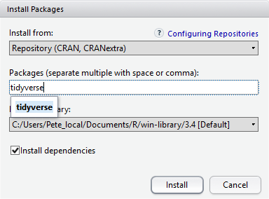

## Objectives

- Install latest version of R and RStudio
- Navigate the RStudio interface
- Set up a project and organize files
- Install R packages
- Understand the difference between console and script


## What is R and RStudio?

**R** is a programming language designed for data analysis and statistics. It's free, open-source, and widely used across many fields including biology, psychology, economics, business, and social sciences.

**RStudio** is a user-friendly interface that makes working with R much easier. RStudio is like a dashboard that helps you run R. RStudio let's you build and execute scripts easily as well as visualize your environment suck as objects and packages. You need both R and RStudio installed on your computer - RStudio won't work without R.

## Why use R?

### Reproducible analysis
When you write R code instead of clicking through menus, you create a permanent record of your analysis. If you get new data or need to fix something, you just run your code again - no need to remember which buttons you clicked in which order. This makes your work transparent and easy to share with collaborators.

Working with scripts forces you to think more carefully about your analysis steps and helps you catch mistakes. Your future self (and your collaborators) will thank you for having a clear record of what you did.

### Powerful and flexible
With over 10,000 available packages, R can handle everything from basic statistics to machine learning, data visualization, web scraping, and specialized analyses for different fields. Whether you need to analyze survey data, create interactive maps, build predictive models, or perform advanced statistical tests, there's likely an R package for it.

R integrates statistical approaches from many scientific disciplines, allowing you to combine methods to best suit your analytical needs.

### Great graphics
R creates publication-quality plots and charts that you can customize in endless ways. From simple bar charts to complex multi-panel figures, interactive plots, and animated visualizations, R's graphics capabilities are exceptional. You can control every aspect of your plots to effectively communicate your findings.

### Free and well-supported
R is completely free and open-source, which means anyone can inspect the code to see how it works. This transparency reduces the chance of errors, and when bugs are found, they can be reported and fixed by the community.

There's a large, helpful community where you can find answers to questions on sites like Stack Overflow, the RStudio Community forum, and through extensive online documentation. Many universities and organizations offer R training because it's accessible to everyone.

### Works with any size data
Whether you have 100 rows or 100 million rows of data, R can handle it. R is designed specifically for data analysis and comes with built-in features for handling missing data, different data types, and statistical operations.

The skills you learn with R scale easily with the size of your dataset - the same code that works on small data will work on large datasets with minimal changes.

## Setting up RStudio

When you open RStudio, you'll see four main areas (called "panes"):


- **Top Left - Source/Script Editor**: Where you write and edit your R scripts
- **Bottom Left - Console**: Where code runs and results appear immediately  
- **Top Right - Environment/History**: Shows your data objects and command history
- **Bottom Right - Files/Plots/Packages/Help**: File browser, plot viewer, package manager, and help documentation

You can customize the layout of these panes through **Tools > Global Options > Pane Layout**.

### The Console
The console is where R actually runs your commands. You'll see a `>` prompt when R is ready for input. You can type commands directly here and press Enter to run them, but the commands won't be saved.

If you see a `+` prompt instead of `>`, it means R is waiting for more input (usually because you forgot to close a parenthesis or quotation mark). Press Escape to cancel and start over.

### The Script Editor
This is where you write your R code in script files (`.R` files). Scripts are saved permanently and can be run repeatedly. To run code from a script:
- Place your cursor on the line you want to run and press **Ctrl+Enter** (Mac: **Cmd+Enter**)
- Select multiple lines and press **Ctrl+Enter** to run them all
- Use **Ctrl+Shift+Enter** to run the entire script

### Environment and History
The Environment pane shows all the objects (data, variables, functions) you've created in your current session. The History pane shows all the commands you've run.

### Files, Plots, Packages, and Help
- **Files**: Browse and manage files in your project
- **Plots**: View graphs and charts you create
- **Packages**: Install and manage R packages
- **Help**: Access documentation and help files

## Creating and managing projects

RStudio Projects help you keep your work organized and make it easy to share your analysis with others. A project creates a self-contained folder with all your scripts, data, and outputs.

### Creating a new project

1. Go to **File > New Project**
2. Choose **New Directory > New Project**
3. Give your project a name (like "r-workshop")
4. Choose where to save it on your computer
5. Click **Create Project**

RStudio will create a new folder with your project name and a `.Rproj` file. Double-clicking this file will always open your project in RStudio.

### The working directory
Your working directory is the folder where R looks for files and saves outputs. When you use RStudio Projects, your working directory is automatically set to your project folder. You can check this with:


``` r
getwd()
```

## Organizing your files

Good organization makes your work easier to understand and share. Create these folders in your project:


``` r
dir.create("scripts") 
dir.create("output")
dir.create("figures")
```

**Recommended folder structure:**

- **data/**: Store your raw data files here. Keep original data files unchanged and do all cleaning in R scripts
- **scripts/**: Keep your R code files here, organized by analysis type
- **output/**: Save processed datasets and results here
- **figures/**: Save plots and graphs here


This structure makes it easy to find files and ensures your analysis can be reproduced by others.

## Installing packages

Packages extend R's capabilities by adding new functions. You'll need to install packages before you can use them.

### Method 1: Using the Packages pane
1. Click the **Packages** tab (bottom right pane)
2. Click **Install**
3. Type the package name (like "tidyverse")
4. Make sure "Install dependencies" is checked
5. Click **Install**



### Method 2: Using code
Type this in the console:


``` r
install.packages("tidyverse")
```

**Important package for this workshop:**

**tidyverse** is a collection of packages for data manipulation and visualization that you will need to for workshop.

You only need to install packages once, but you need to load them in each R session using:


``` r
library(tidyverse)
```


## Console vs. Script: Best practices

**Console**: 

- Good for quick calculations and testing
- Commands are not saved
- Results disappear when you close R

**Scripts**: 

- Save all your work permanently
- Can be shared with others
- Easy to modify and rerun
- Essential for reproducible research

**Golden rule**: Always write your important code in scripts, not just in the console!

## Helpful keyboard shortcuts

- **Ctrl+Enter** (Mac: **Cmd+Enter**): Run current line or selection
- **Ctrl+Shift+Enter**: Run entire script
- **Ctrl+L**: Clear console
- **Tab**: Auto-complete code
- **Ctrl+Z**: Undo

## Exercise

Let's practice setting up a proper R workflow:

1. **Install R and RStudio**: Make sure you have the latest versions installed
2. **Create a new project** called "r-workshop"
3. **Create the folder structure** (scripts, output, figures)
4. **Install required packages** (tidyverse and here)


## Getting help

- **In R**: Use `?function_name` to get help on any function
- **RStudio**: Press F1 while cursor is on a function name
- **Online**: Stack Overflow, RStudio Community, R documentation
- **Error messages**: Read them carefully - they often tell you exactly what's wrong!

## Key takeaways

- R and RStudio work together--R is the language, RStudio is the interface
- Projects help keep your work organized and reproducible
- Scripts are better than console for saving your work
- Packages extend R's capabilities
- Good organization makes your analysis easier to understand and share

$~$
